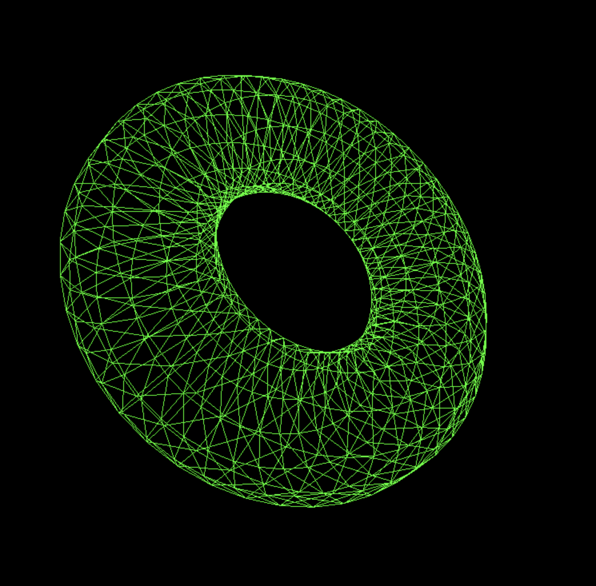

# Boiler-plate ThreeJS app

https://sbcode.net/threejs/

Run this to install all necessary node modules:

```
npm install
```

Then run this to start the application.

```
npm run dev
```

Open [localhost:8080](http://localhost:8080) and you should see this:

